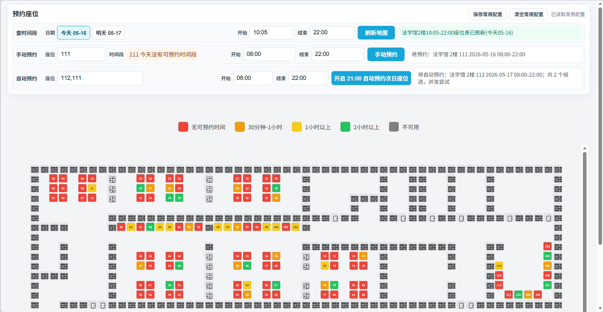
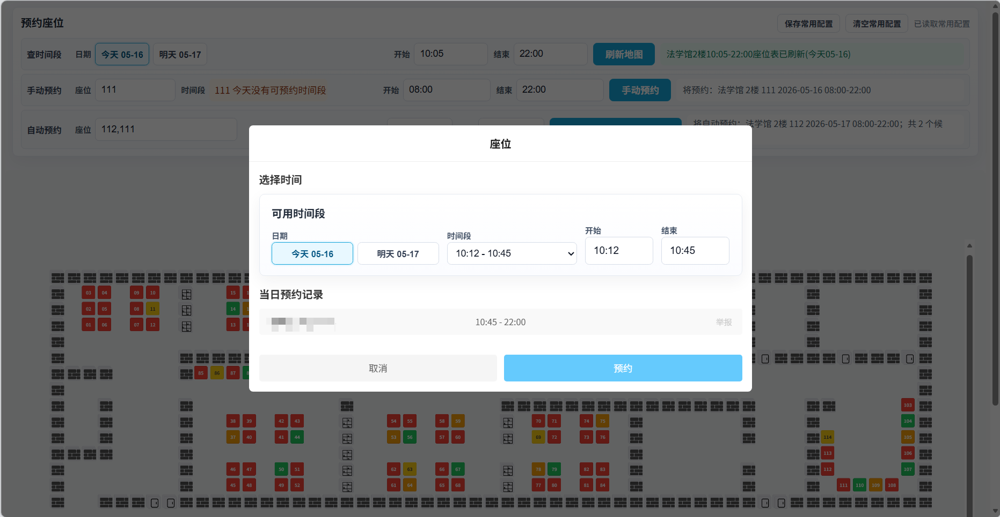
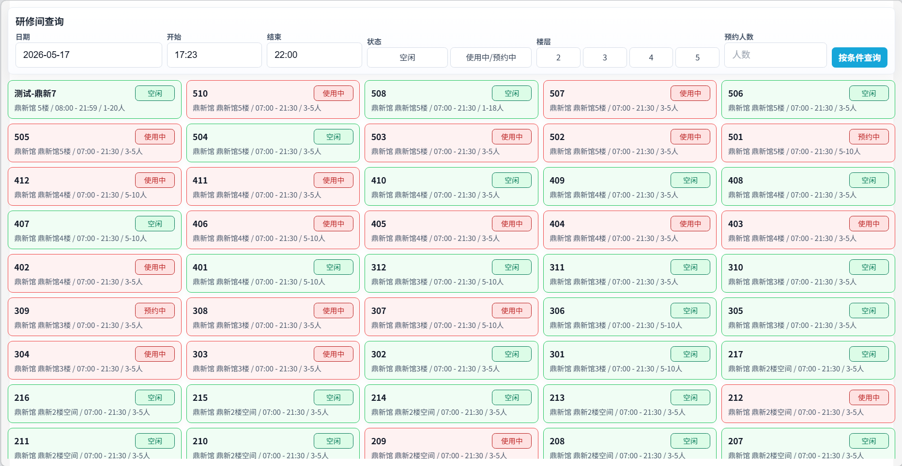
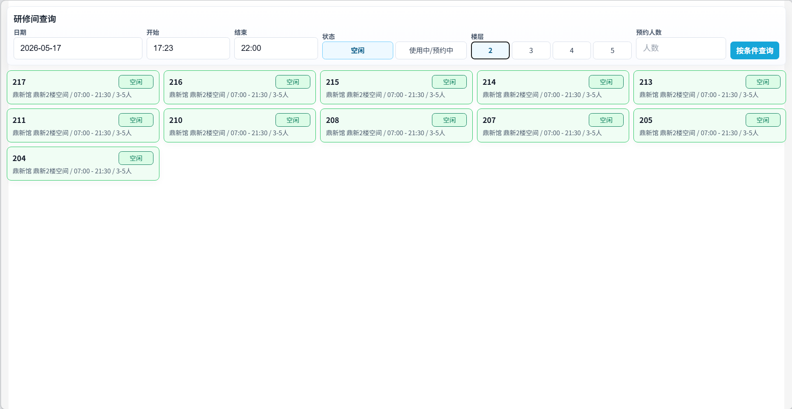

# JLU LibSeat PC Wide Layout

吉林大学图书馆预约网页增强脚本。

已上传 Greasy Fork ，链接： [JLU LibSeat PC Wide Layout](https://greasyfork.org/zh-CN/scripts/578282-jlu-libseat-pc-wide-layout) 

脚本主要面向 [吉林大学图书馆座位预约](https://libseat.jlu.edu.cn)，用于改善 PC 浏览器里的座位地图、时间选择和座位预约体验。
同时也优化了研修间预约页面，方便在 PC 浏览器中按条件筛选研修间、查看当日预约记录并直接提交研修间预约。

## 功能

### 座位预约：

- 扩展 H5 页面宽度，优化 PC 浏览器下的座位地图显示。

- 根据座位当天可预约时长标色：
  - 橙色：30 分钟到 1 小时
  - 黄色：1 到 2 小时
  - 绿色：2 小时以上
  - 红色：占用或不可预约
  
- 替换原始时间选择器，支持直接输入开始和结束时间，可以点击/ `Tab` 选中时间后输入 `0800` 修改为 `08:00`。

- 手动预约行和座位详情页都有可用时间段下拉和开始/结束时间，提交结果会显示楼层/阅览室、座位、日期和时间段。

- 自动预约默认在 21:00 预约次日，可填写多个候选座位，预约时会并发尝试，直到其中一个成功。

- 可保存常用配置到浏览器本地存储，包括手动/自动预约的候选座位/时间。

- 点击座位后，预约记录里会显示用户详情；无可预约时间的座位也可以点击查看预约记录。

### 研修间预约：

- 刷新后一次性展示研修间列表，不再需要点击加载更多。
- 支持按楼层、日期、状态和预约人数筛选研修间；楼层和状态可多选，也可以再次点击取消选择。
- 研修间弹窗会展示当日详细预约记录，可直接填写预约时间、会议主题、会议内容和成员。

## 安装

1. 安装浏览器 userscript 扩展，例如 [Tampermonkey](https://www.tampermonkey.net/) 或 [Violentmonkey](https://violentmonkey.github.io/get-it/)。
2. 打开仓库中的 `libseat_pc_wide.user.js` 安装到扩展中，或者使用 Greasy Fork 链接 [JLU LibSeat PC Wide Layout](https://greasyfork.org/zh-CN/scripts/578282-jlu-libseat-pc-wide-layout) 安装。
3. 访问 [https://libseat.jlu.edu.cn](https://libseat.jlu.edu.cn) 进行预约。

## 使用

进入选座页面后，页面顶部会出现三行增强预约区域：

- “查时间段”：选择今天或明天，填写开始/结束时间刷新座位图。
- “手动预约”：填写地图上的一个座位号，可选择可用时间段，也可以再修改开始/结束时间，点击“手动预约”提交当天预约。
- “自动预约”：填写地图上的一个或多个座位号和开始/结束时间，点击按钮开启或关闭 21:00 自动预约次日座位。

点击标题右侧的“保存常用配置”后，脚本会在下次刷新页面时自动恢复手动/自动预约候选座位/时间。点击“清空常用配置”会删除本地保存的数据，并把当前页面恢复为默认值。

自动预约的座位号可以填写多个候选，例如 `62, 63, 64`，脚本会同时尝试直到其中一个预约成功。

---

进入研修间预约页面后，查询栏可以输入日期和预约人数，并通过楼层、状态按钮筛选研修间；点击研修间卡片会打开预约弹窗。研修间预约弹窗中可以直接填写日期、开始时间、结束时间、会议主题、会议内容和成员学号。右侧当日预约记录会显示预约人和真实预约时间，方便确认当前研修间当天的占用情况。

## 截图

---

此为个人使用的页面增强脚本，在 codex 辅助下完成，非官方项目。脚本依赖当前网页结构和接口返回，站点更新后可能需要同步调整。

有任何问题欢迎提 issue 或 pr (❁´◡`❁)
